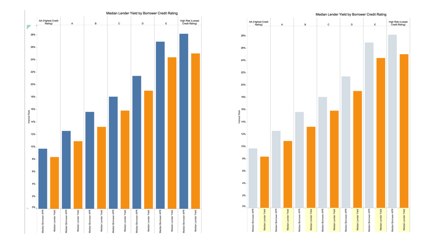

Prosper Analysis with Tableau
=============================

 

Summary
-------

Prosper is a company that services loans, allowing borrowers to borrow money for a term of 3 or 5 years and within a range of $2,000 to $35,000. The loans are funded by a pool of investors who can invest in multiple loans and profit by the interest charged as the loans are repaid by borrowers. The better a borrower's credit score, the lower the risk of a borrower defaulting on a loan but also the lower the profit margin as interest rates are lowest for borrowers with better credit scores. This analysis will illustrate the risk vs profit potential for investors based on borrowers' credit scores, stated monthly income, monthly revoling debt, and reason for the loan.  

Design
------

After looking at the data and getting background information about the company on the Prosper.com website, I decided that the story this visualization would tell would be about the risk of investing in loans vs. the reward potential as determined by the borrower's credit grade. I wanted the visualization to show the relationship between the borrowers' credit grades, the rate of return, and the risk of the borrower defaulting on the loan within each credit grade.    The first step was to go into R Studio and remove fields which were not relevant to the story. I referenced the data dictionary on the Prosper.com Developer web pages to ensure that I knew the purpose of each field. I then exported a new csv file and imported it into Tableau. Next, I excluded data which had Null values from the worksheets.    The charts were designed to have a consistent frame of groupings by credit grade while evaluating different variables. Bar charts grouped by credit grade showing potential interest rate of return, loan default rates, monthly income, and stated reason for the loan.   

Feedback
--------

The original version of the analysis, file: ProsperAnalysis.twbx, shows the visualization before getting feedback.  The improved version, file: ProsperAnalysis-AfterFeedback.twbx, shows the visualizations after getting feedback.
  
Feedback was that the story made sense and was easy to follow in the visualizations. The only negative comment was that in the loan purpose chart, the lines separating the groupings by credit grade were too light and it was hard to see where each group began and ended. To fix that, I formatted the line separators and made them darker and thicker.    I noticed that when people looked at the charts, reading the legend at a 90 degree angle was not comfortable and viewers had to bend their heads to the side to read the axis labels. Where possible, I formatted the labels to be darker and not rotated.    Chart: Median Lender Yield by Borrower Credit Rating  The most important field to the investor is the Yield on the loan by Credit Grade. To make that column stand out, I made the other column (Median Borrower APR) gray while the Median Lender Yield is orange.    Improvements:  - Before I got feedback, this chart showed both bars as equally prominent. After getting feedback, I grayed out the less important bar to the investor and added color and highlights to the most important information on the chart.     - For the Loans Completed vs Defaulted chart, after getting feedback I added percentage labels to the bars on the chart to further show that borrowers with lower credit grades default at a much higher rate than those with excellent credit grades.    - Average Loan Amount and Reason for Loan also shows the average original loan amount all grouped by credit grade. To make the groupings clearer, I added a darker separation line between each group.   

Resources
---------

<a href="https://classroom.udacity.com/nanodegrees/nd002/parts/38e740f3-bea2-43cb-a474-1de2abe3ec4b/modules/acbe4df1-d046-40fd-a2e5-8e1a777c339f/lessons/820d84b6-974f-4531-b4da-371de2f91e79/concepts/b337a5fa-b932-4159-8972-4461ed3f4963">Udacity Data Visualization Course: Telling Stories with Tableau</a>    <a href="https://www.tableau.com/learn/training">Tableau Desktop Training</a>
